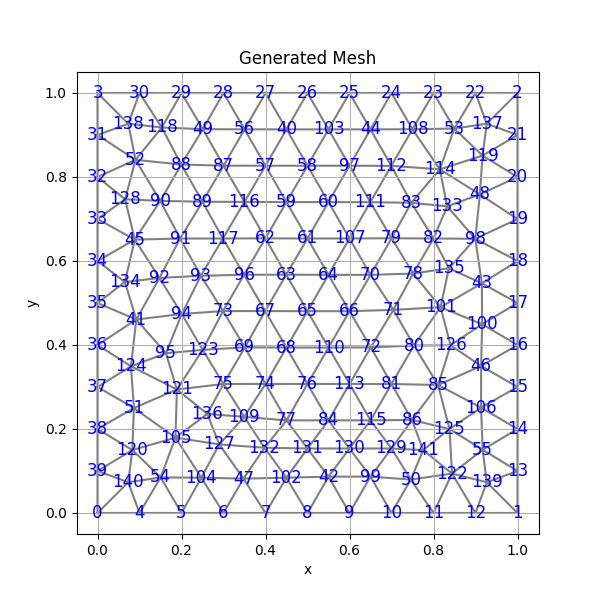

# 有限要素法の基礎

[0.1]×[0.1]上でポアソン方程式をディリクレ境界条件で解く。
問題設定は、有限要素法概説(新訂版)p.109 例7.5による。

# m=2の場合
下図はメッシュ分割 m=2 の例。

ch7.pyではこのようなメッシュ上でポアソン方程式を
有限要素法により解く。
その結果の中心点でのuの値が0.06249999999999999となり
p.110の表7.3のm=2の場合を再現する。

# m=2~10の場合
同様のことをm=2~10の場合で実施した際の結果が下表。

p.110の表7.3の再現になっている。

# pygmesh,meshioを用いた場合
ここまでは自作でメッシュを生成した。
続いて既存ライブラリpygmesh,meshioを用いてメッシュ
を生成する場合を考える。(ch6.py)

ある程度細かく取って上図のようなメッシュの上で
ポアソン方程式を解くことを考える。
問題設定は先と変わらない。

ch9.pyではch7.pyと同じ流れで有限要素法が解かれる。
結果、

uの最大値: 0.07359522089353254

最大値の位置 (ノード番号): 65

座標: [0.49986178 0.48046759]

であり、p.110に書いてある厳密解0.07367の近似値
になっていることが確認できる。